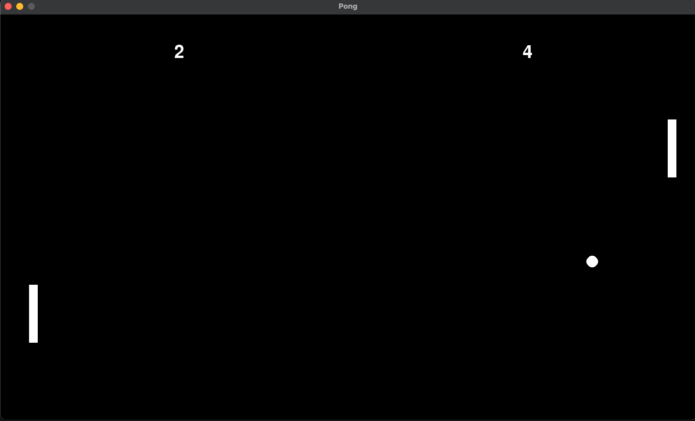

# pong-game-2p
A classic 2-Player Pong game implemented using Pygame

## Features

- Classic Pong gameplay with two paddles and a bouncing ball.
- Enhanced ball physics for more engaging and unpredictable gameplay.
- Collision detection improvements to handle high-speed movements and prevent glitches.
- Sound effects for scoring and ball bounce events.

### Controls
- Player 1: Use "W" and "S" to move the left paddle up and down.
- Player 2: Use "UP" and "DOWN" arrow keys to move the right paddle.

### Installation

To run this game, you need Python and Pygame installed on your system.
- Python (version 3.10 or newer)
- Pygame (version 2.1.2 or newer)

